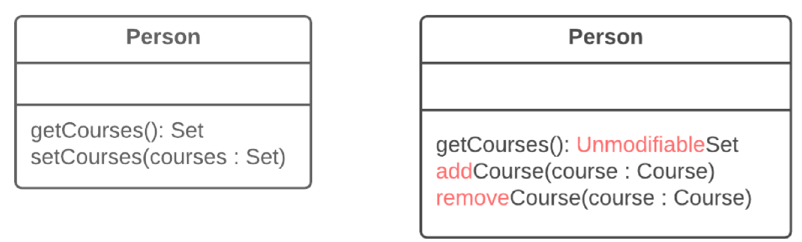

=== 1.11. Інкапсуляція колекції (Encapsulate Collection)

*Проблема*

Клас містить поле-колекцію, а також простий геттер і сеттер для роботи з цією колекцією

*Рішення*

Зробіть значення, що повертає геттер, доступним тільки для читання, а також створіть методи додавання/видалення елементів цієї колекції.

*Причини рефакторингу*

В класі є поле, що містить колекцію об’єктів. Ця колекція може бути масивом, списком, множиною або вектором. Для роботи з нею створений звичайний геттер і сеттер.

Проте колекції повинні використовувати протокол, дещо відмінний від того, який використовується іншими типами даних. Метод отримання не повинен повертати сам об’єкт колекції, тому що це дозволило б клієнтам змінювати вміст колекції без відома класу, що володіє нею. Крім того, таке рішення надмірно розкривало б клієнтам будову внутрішніх структур даних об’єкта. Метод отримання елементів колекції повинен повертати таке значення, яке не дозволяло б змінювати колекцію і не розкривало б зайвих даних про її структуру.

Крім того, не варто використовувати метод, що присвоює колекції певне значення. Замість цього у вашому коді повинні застосовуватися операції для додавання і видалення елементів. Таким чином, об’єкт-власник отримує контроль над додаванням і видаленням елементів колекції.

Такий протокол здійснює коректну інкапсуляцію колекції, що, у результаті, зменшує зв’язаність між класом, що володіє нею, і клієнтським кодом.

*Переваги*

* Поле колекції інкапсульовано всередині класу. При виклику геттера повертається копія колекції, що унеможливлює випадкову зміну або затирання вмісту елементів колекції без відома об’єкта, що її містить.
* У випадку якщо елементи колекції містяться всередині примітивного типу, наприклад, масиву, ви створюєте зручніші методи роботи з колекцією.
* Якщо елементи колекції містяться всередині непримітивного контейнеру (стандартного класу колекцій), інкапсулюйте колекцію, таким чином ви зможете обмежити доступ до небажаних стандартних методів колекції (наприклад, зможете обмежити додавання нових елементів).

*Порядок рефакторингу*

. Створіть методи для додавання і видалення елементів колекції. Вони повинні приймати елементи колекції в параметрах.

. В якості початкового значення поля використайте порожню колекцію у тому випадку, якщо конструктор класів цього ще не робить.

. Знайдіть виклики сеттера поля колекції. Змініть сеттер так, щоб він використав операції додавання і видалення елементів, або зробіть так, щоб ці операції викликав клієнтський код.

. Зверніть увагу, що сеттери можуть бути використані тільки для того, щоб замінити всі елементи колекції іншими. Виходячи з цього, можливо, має сенс змінити назву сеттера на replace.

. Знайдіть усі виклики геттера колекції, після яких відбувається зміна колекції. Поміняйте цей код так, щоб там використовувалися ваші нові методи додавання і видалення елементів колекції.

. Змініть геттер так, щоб він повертав представлення колекції, доступне тільки для читання.

. Обстежте клієнтський код, що використовує колекцію, у пошуках ділянки, яку краще перемістити всередину самого класу колекції.