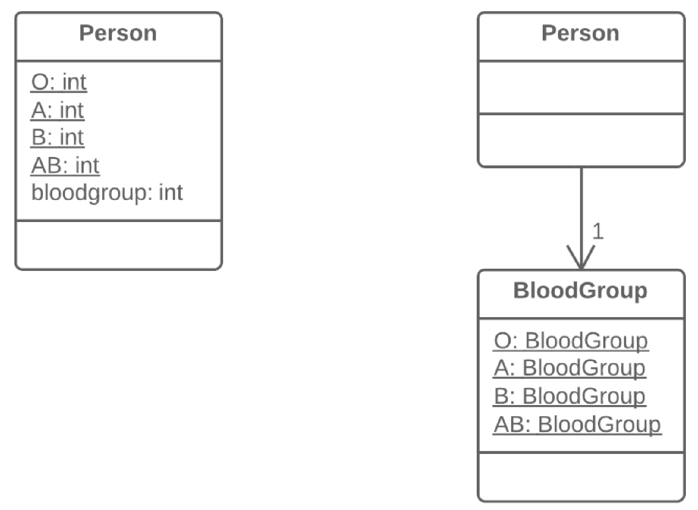

=== 1.12. Заміна кодування типу класом (Replace Type Code with Class)

Що таке кодування типу? Це коли замість окремого типу даних ви маєте набір чисел або рядків, який складає список допустимих значень для якоїсь сутності. Часто цим конкретним числам і рядкам даються зрозумілі імена за допомогою констант, що і є причиною їх широкого поширення.

*Проблема*

У класі є поле, що містить кодування типу. Значення цього типу не використовуються в умовних операторах і не впливають на поведінку програми.

*Рішення*

Створіть новий клас і застосовуйте його об’єкти замість значень закодованого типу.

*Причини рефакторингу*

Однією з найчастіших причин появи кодування типу є робота з базою даних, в полях якої є складна концепція, що кодується якимось числом або рядком.

Наприклад, у вас є клас Користувач з полем роль_користувача, в якій міститься інформація про доступ кожного користувача, будь то адміністратор, редактор або звичайний користувач. Причому ця інформація кодується в поле як символи A, E, і U відповідно.

Недоліками цього підходу є те, що в сеттерах поля часто немає ніяких перевірок на те, яке значення туди приходить, що може привести до великих проблем, якщо хтось відправить до цих полів якісь інші значення.

Проблема також посилюється тим, що для таких полів неможливо зробити перевірку типів. У них можна відправити будь-яке число або рядок, і це значення залишиться зовсім без перевірки типів вашої IDE і навіть при наявності помилок програма запуститься.

*Переваги*

* Ми хочемо перетворити набори значень примітивних типів, якими є закодовані типи, в стрункі класи, які б мали всі потужні властивості ООП.
* Замінивши кодування типу класами, ми забезпечимо можливість контролю і перевірки типів значень (type hinting), що передаються в методи і поля на рівні мови програмування.
* Наприклад, якщо раніше, при передачі значення в метод компілятор не бачив різниці між вашою числовою константою і якимось довільним числом, то тепер при передачі даних, що відрізняються чимось від вказаного класу типу, ви отримаєте повідомлення про помилку ще всередині вашої IDE.
* Таким чином, ми зробимо можливим перенесення коду в самі класи типу. Якщо вам треба було проводити якісь складні маніпуляції зі значеннями типу в різних місцях програми, тепер цей код зможе «жити» усередині одного або декількох класів типу.

*Коли не слід застосовувати*

Якщо значення закодованого типу використовуються всередині управляючих структур (if, switch та ін.), які управляють якоюсь поведінкою класу, вам слід удатися до одного з двох інших рефакторингів усунення кодування типу:

* заміна кодування типу підкласами
* заміна кодування типу станом/стратегією

*Порядок рефакторингу*

. Створіть новий клас і дайте йому зрозумілу назву, що відповідає призначенню закодованого типу. Ми називатимемо його клас типу.

. У клас типу скопіюйте поле, що містить кодування типу, і зробіть його приватним. Крім того, створіть для цього поля геттер. Встановлюватися значення в це поле буде тільки з конструктора.

. Для кожного значення закодованого типу створіть статичний метод в класі типу. Він створюватиме новий об’єкт класу типа, що відповідає цьому значенню закодованого типу.

. У початковому класі, замініть тип закодованого поля на клас типу. Створіть новий об’єкт цього типу в конструкторі, а також в сеттері поля. Змініть геттер поля так, щоб він викликав геттер класу типу.

. Замініть будь-які згадки значень закодованого типу викликами відповідних статичних методів класу типу.

. Видаліть константи закодованого типу з початкового класу.