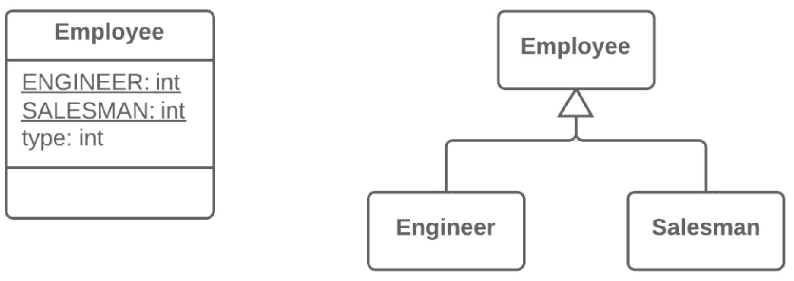

=== 1.13. Заміна кодування типу підкласами (Replace Type Code with Subclasses)

Що таке кодування типу? Це коли замість окремого типу даних ви маєте набір чисел або рядків, який складає список допустимих значень для якоїсь сутності. Часто цим конкретним числам і рядкам даються зрозумілі імена за допомогою констант, що і є причиною їх широкого поширення.

*Проблема*

У вас є закодований тип, який безпосередньо впливає на поведінку програми (ґрунтуючись на значеннях цього поля, в умовних операторах виконується різний код).

*Рішення*

Для кожного значення закодованого типу створіть підкласи. А потім винесіть відповідну поведінку з початкового класу в ці підкласи. Код, що управляє, замініть поліморфізмом.

*Причини рефакторингу*

Цей рефакторинг є складним випадком заміни кодування типу класом.

Як і в першому рефакторингу, у вас є якийсь набір простих значень, з яких складаються всі доступні значення для якогось поля. Хоча ці дані часто задані як константи і мають зрозумілі імена, їх використання може закінчитися появою помилок перевірки типів, оскільки вони все одно є значеннями примітивних типів. Наприклад, у вас є метод, що приймає в параметрах одне з таких значень. У певний момент замість константи USER_TYPE_ADMIN зі значенням "ADMIN", в метод прийде той же рядок, але в нижньому регістрі "admin", що приведе до виконання невідомої дії, відмінної від запланованої автором поведінки.

У цьому рефакторингу ми маємо справу з управляючим кодом, таким як умовні оператори if, switch або ?:. Іншими словами, усередині умов цих операторів використовуються поля із закодованим значенням (напр. $user->type === self::USER_TYPE_ADMIN). Якби ми застосовували тут заміну кодування типу класом, то всі ці управляючи конструкції слід було б теж перенести в клас даних, що відповідають за тип. Зрештою, це зробило б клас типу дуже схожим на початковий клас, в результаті клас типу містив би ті ж проблеми, що й початковий.

*Переваги*

* Видалення управляючого коду. Замість великого switch в початковому класі ви переносите код у відповідні підкласи. Це покращує розділення відповідальності між класами і спрощує читабельність програми в цілому.
* Якщо вам потрібно буде додати нове значення закодованого типу, все, що треба буде зробити, це додати новий підклас, не чіпаючи існуючий код (принцип відкритості/закритості).
* Замінивши кодування типу класами, ми забезпечимо можливість контролю і перевірки типів значень (type hinting), що передаються в методи і поля на рівні мови програмування. При використанні простих чисельних або рядкових значень, що містяться в закодованому типі, таких можливостей у вас не буде.

*Коли не слід застосовувати*

* Цей рефакторинг неможливо застосувати, якщо у вас вже є якась ієрархія класів. Ви не можете створити подвійну ієрархію за допомогою наслідування в ООП. Проте, заміну кодування типу можна здійснити, використовуючи композицію замість наслідування. Для цього використайте заміну кодування типу станом/стратегією.
* Якщо значення закодованого поля може помінятися після того, як об’єкт був створений. При цьому нам би довелося якимось чином міняти клас самого об’єкта «на льоту», а це неможливо. В цьому випадку альтернативою також є застосування заміни кодування типу станом/стратегією.

*Порядок рефакторингу*

. Використайте самоінкапсуляцію поля для створення геттера для поля, яке містить кодування типу.

. Для кожного значення кодованого типу створіть свій власний підклас. У ньому перевизначіть геттер закодованого поля так, щоб він повертав відповідне значення закодованого типу.

. Зробіть конструктор суперкласу приватним. Створіть статичний фабричний метод з тими ж параметрами, що і конструктор суперкласу. Він обов’язково повинен містити параметр, який набуватиме стартових значень закодованого типу. Залежно від цього параметру фабричний метод створюватиме об’єкти різних підкласів. Для цього в його коді доведеться створити великий умовний оператор, але, принаймні, він буде єдиним, який дійсно потрібний, про все інше надалі зможуть потурбуватися підкласи і поліморфізм.

. Видаліть поле із закодованим типом з суперкласу, його геттер зробіть абстрактним.

. Тепер, коли у вас з’явилися підкласи, можете починати переміщати поля і методи з суперкласу у відповідні підкласи (за допомогою спуску поля і спуску методу).

. Коли все, що можна, буде перенесено, використайте заміну умовних операторів поліморфізмом щоб остаточно позбутися від умовних операторів, що використовує закодований тип.