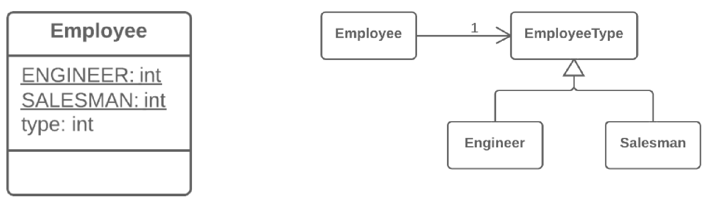

=== 1.14. Заміна кодування типу станом/стратегіє (Replace Type Code with State/Strategy)

Що таке кодування типу? Це коли замість окремого типу даних ви маєте набір чисел або рядків, який складає список допустимих значень для якоїсь сутності. Часто цим конкретним числам і рядкам даються зрозумілі імена за допомогою констант, що і є причиною їх широкого поширення.

*Проблема*

У вас є закодований тип, який впливає на поведінку, але ви не можете використати підкласи, щоби позбутися від нього

*Рішення*

Замініть кодування типу об’єктом-станом. При необхідності замінити значення поля з кодуванням типу в нього підставляється інший об’єкт-стан.

*Причини рефакторингу*

У нас є кодування типу, і воно впливає на поведінку класу, тому ми не можемо замінити кодування типу класом.

Кодування типу впливає на поведінку класу, але ми не можемо створювати підкласи для закодованого типу зважаючи на наявність існуючої ієрархії класів або з інших причин. А це означає, що ми також не можемо застосувати заміну кодування типу підкласами.

*Переваги*

* Цей рефакторинг надає вихід з ситуації, коли поле із закодованим типом міняє своє значення в процесі життя об’єкта. В цьому випадку заміна значення робиться шляхом заміни об’єкта-стану, на який посилається початковий клас.
* Якщо вам потрібно буде додати нове значення закодованого типу, все, що доведеться зробити, це додати новий підклас-стан, не чіпаючи існуючий код (принцип відкритості/закритості).

*Недоліки*

Якщо за наявності простого випадку кодування типу застосовується цей рефакторинг, як результат, з’являється багато зайвих класів.

*Корисні факти*

Цей рефакторинг може використовувати реалізацію одного з двох патернів проектування — Стану або Стратегії. Реалізація цього рефакторингу залишається однаковою незалежно від того, який з патернів ви оберете. Та все ж, варто розібратися, який саме патерн краще вибрати у вашій ситуації.

Вам підійде Стратегія, якщо ви намагаєтеся розділити умовний оператор, що управляє вибором того або іншого алгоритму.

Але якщо кожне значення закодованого типу відповідає не просто за альтернативну версію алгоритму, а за цілий стан класу, значення полів і безліч інших дій, вам більше підійде патерн Стан.

*Порядок рефакторингу*

. Використайте самоінкапсуляцію поля для створення геттера для поля, яке містить кодування типу.

. Створіть новий клас і дайте йому зрозумілу назву, що відповідає призначенню закодованого типу. Цей клас гратиме роль Стану (чи Стратегії). Створіть в ньому абстрактний геттер закодованого поля.

. Створіть підкласи класу-стану для кожного значення закодованого типу. У кожному підкласі перевизначте геттер закодованого поля так, щоб він повертав відповідне значення закодованого типу.

. В абстрактному класі стану створіть статичний фабричний метод, що набуває в параметрі значення закодованого типу. Залежно від цього параметра фабричний метод створюватиме об’єкти різних станів. Для цього в його коді доведеться створити великий умовний оператор, але він буде єдиним після завершення рефакторингу.

. У початковому класі поміняйте тип закодованого поля на клас-стан. У сеттері цього поля викликайте фабричний метод стану для отримання нових об’єктів станів.

. Тепер можете починати переміщати поля і методи з суперкласу у відповідні підкласи-стани (за допомогою спуску поля і спуску методу).

. Коли всі потрібні дані будуть перенесені, використайте заміну умовних операторів поліморфізмом, щоб остаточно позбутися від умовних операторів, які використовують закодований тип.