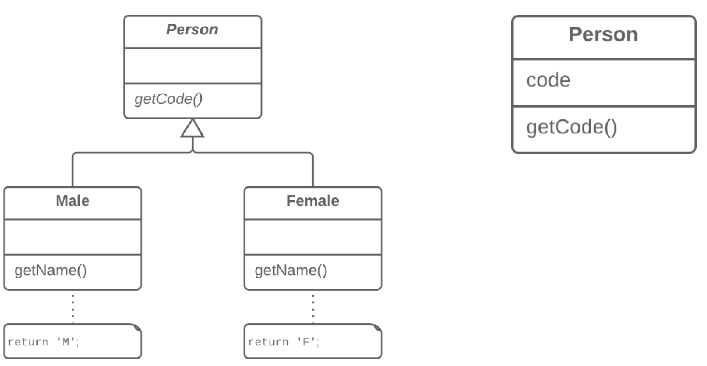

=== 1.15. Заміна підкласу полями (Replace Subclass with Fields)

Що таке кодування типу? Це коли замість окремого типу даних ви маєте набір чисел або рядків, який складає список допустимих значень для якоїсь сутності. Часто цим конкретним числам і рядкам даються зрозумілі імена за допомогою констант, що і є причиною їх широкого поширення.

*Проблема*

У вас є підкласи, які відрізняються тільки методами, що повертають дані-константи.

*Рішення*

Замініть методи полями в батьківському класі і видаліть підкласи.

*Причини рефакторингу*

Буває так, що вам треба розгорнути дію рефакторингу позбавлення від кодування типу.

В одному з подібних випадків ієрархія підкласів може відрізнятися тільки значеннями, які повертають певні методи. Причому ці значення не є результатом обчислення, а жорстко прописані або в самих методах, або в полях, які повертають методи. Щоб спростити архітектуру класів, така ієрархія може бути згорнута в один клас, що містить одне або декілька полів з потрібними значеннями залежно від ситуації.

Потреба в цих змінах могла виникнути після переміщення великої кількості функціональності з ієрархії класів кудись в інше місце. Після цього поточна ієрархія втратила свою цінність, і підкласи стали створювати тільки надмірну складність.

*Переваги*

Спрощує архітектуру системи. Створення підкласів — зайве рішення, якщо все, що треба зробити, це повертати різні значення в декількох методах

*Порядок рефакторингу*

. Застосуйте до підкласів заміну конструктора фабричним методом.

. Якщо якийсь код посилається на підкласи, замініть його використанням суперкласу.

. Оголосіть в суперкласі поля для зберігання значень кожного з методів підкласів, що повертають константні значення.

. Створіть захищений конструктор суперкласу для ініціалізації нових полів.

. Створіть або модифікуйте наявні конструктори підкласів, щоб вони викликали новий конструктор батьківського класу і передавали в нього відповідні значення.

. Реалізуйте кожен константний метод у батьківському класі так, щоб він повертав значення відповідного поля, а потім видаліть метод з підкласу.

. Якщо конструктор підкласу має якусь додаткову функціональність, застосуйте вбудовування методу для вбудовування конструктора у фабричний метод суперкласу.

. Видаліть підклас.