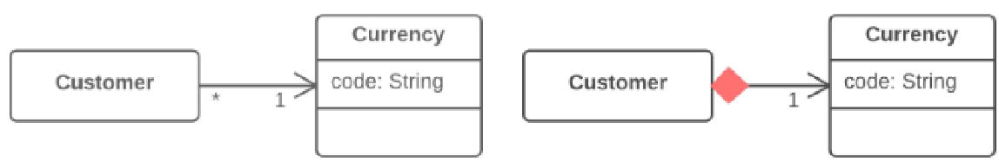

=== 1.4. Заміна посилання значенням (Change Reference to Value)

*Проблема*

У вас є об’єкт-посилання, який занадто маленький і незмінний, щоб виправдати складнощі по управлінню його життєвим циклом.

*Рішення*

Перетворіть його на об’єкт-значення.

*Причини рефакторингу*

Спонукати до переходу від посилання до значення можуть незручності, які виникають при роботі з об’єктом-посиланням.

Об’єктами-посиланнями необхідно якимось чином управляти:

* кожного разу доводиться просити в об’єкта-сховища потрібний об’єкт;
* посилання в пам’яті теж можуть виявитися незручними в роботі;
* працювати з об’єктами-посиланнями, на відміну від об’єктів-значень, особливо складно в розподілених і паралельних системах.

Крім того, об’єкти-значення будуть особливо корисні, якщо вам більше потрібна незмінність об’єктів, ніж можливість зміни їх стану під час життя об’єкта.

*Переваги*

* Важлива властивість об’єктів-значень полягає в тому, що вони мають бути незмінними. При кожному запиті, що повертає значення одного з них, повинен виходити однаковий результат. Якщо це так, то не виникає проблем за наявності багатьох об’єктів, що представляють одну і ту ж річ.
* Об’єкти-значення набагато простіші в реалізації.

*Недоліки*

Якщо значення може змінюватись, вам необхідно забезпечити, щоби при зміні будь-якого з об’єктів оновлювалися значення в усіх інших, які представляють ту ж саму річ. Це настільки обтяжливо, що простіше для цього створити об’єкт-посилання.

*Порядок рефакторингу*

. Забезпечте незмінність об’єкта. Об’єкт не повинен мати сеттерів або інших методів, що міняють його стан і дані (у цьому може допомогти видалення сеттера). Єдиним місцем, де полям об’єкта-значення присвоюються якісь дані, має бути конструктор.
. Створіть метод порівняння для того, щоби мати можливість порівняти два об’єкти-значення.
. Перевірте, чи можливо видалити фабричний метод і зробити конструктор об’єкта публічним.