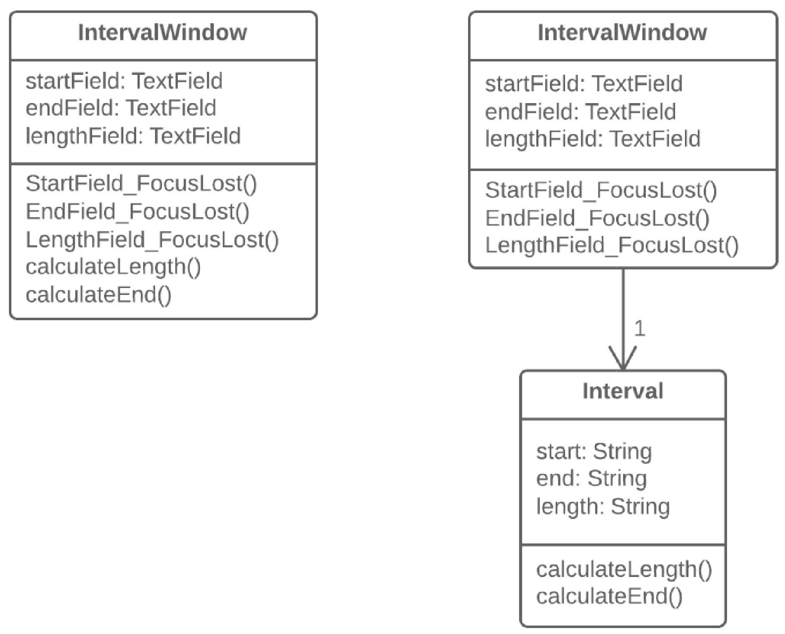

=== 1.6. Дублювання видимих даних (Duplicate Observed Data)

*Проблема*

Дані предметної області програми зберігаються в класах, що відповідають за призначений для користувача інтерфейс (GUI).

*Рішення*

Має сенс виділити дані предметної області в окремі класи і, таким чином, забезпечити зв’язок і синхронізацію між класом предметної області і GUI.

*Причини рефакторингу*

* Ви розділяєте відповідальність між класами бізнес-логіки і представлення (принцип єдиного обов’язку), що спрощує читабельність і розуміння програми в цілому.
* Якщо потрібно буде додати новий вид інтерфейсу, вам треба буде створити нові класи представлення, при цьому код бізнес-логіки чіпати немає ніякої нужди (принцип відкритості/закритості).
* Над бізнес-логікою і призначеними для користувача інтерфейсами тепер можуть працювати різні люди.

*Коли не слід застосовувати*

* Цей рефакторинг, який в класичному виконанні здійснюється з введенням патерна Спостерігач, практично не застосовується для веб-додатків, де всі класи перестворюються при кожному запиті до веб-сервера.
* Проте, загальний принцип відокремлення бізнес-логіки в окремі класи має сенс, у тому числі, і для веб-додатків. Але реалізується він за допомогою інших рефакторингів, які обираються з урахуванням дизайну вашої системи.

*Порядок рефакторингу*

. Необхідно приховати прямий доступ до даних предметної області в _класі GUI _, для чого краще за все використати самоінкапсуляцію поля. Таким чином, ви створите геттери і сеттери до цих даних.

. В обробниках подій класу GUI використайте сеттери для установки нових значень полів. Це дасть можливість передавати нові значення в пов’язаний об’єкт предметної області.

. Створіть клас предметної області і скопіюйте в нього необхідні поля з _класу GUI _. Для всіх цих полів створіть геттери і сеттери.

. Застосуйте патерн Спостерігач до цих двох класів:

    ** В класі предметної області створіть масив для зберігання об’єктів спостерігачів (об’єктів GUI ), а також методи їх реєстрації, видалення і сповіщення.

    ** В класі GUI створіть поле для зберігання посилання на об’єкт предметної області, а також метод update(), який реагуватиме на зміни в цьому об’єкті та буде оновлювати значення полів в _класі GUI _. Зверніть увагу, в методі оновлення значення повинні встановлюватися безпосередньо, щоб уникнути рекурсії.

    ** У конструкторі класу GUI створіть екземпляр класу предметної області і збережіть його в створеному полі. Зареєструйте об’єкт GUI як спостерігач в об’єкті предметної області.

    ** У сеттерах полів класу предметної області викликайте метод сповіщення спостерігача (тобто метод оновлення в класі GUI), щоби передати нові значення в призначений для користувача інтерфейс.

    ** Змініть сеттери полів класу GUI так, щоб вони тепер встановлювали нові значення в об’єкті предметної області, причому безпосередньо. Будьте уважні, якщо значення встановлюватимуться через сеттер класу предметної області, це приведе до нескінченної рекурсії..