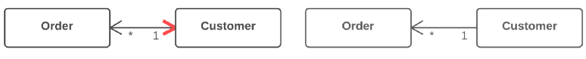

=== 1.8. Заміна двонаправленого зв'язку одностороннім (Change Bidirectional Association to Unidirectional)

*Проблема*

У вас є двосторонній зв’язок між класами, але один з класів більше не використовує фічі іншого.

*Рішення*

Приберіть невживаний зв’язок.

*Причини рефакторингу*

Двосторонній зв’язок, як правило, складніше підтримувати, ніж односторонній. Такий зв’язок вимагає наявності додаткового коду, який би відстежував коректне створення і видалення пов’язаних об’єктів, що призводить до ускладнення програми.

Крім того, неправильно реалізований двосторонній зв’язок може призвести до появи проблем з «очищенням сміття», тобто звільнення пам’яті, зайнятої невживаними об’єктами.

Наведемо приклад: «збирач сміття» видаляє з пам’яті об’єкти, на які вже не залишилося посилань з інших об’єктів програми. Припустимо, була створена, використана, після чого покинута пара об’єктів Користувач-Замовлення. Проте ці об’єкти не будуть очищені з пам’яті, оскільки вони все ще містять посилання один на одного. Проте потрібно розуміти, що ця проблема вже втрачає актуальність. З нею навчилися боротися багато сучасних версій мов програмування, які автоматично виявляють невживані зв’язки об’єктів і успішно очищають їх з пам’яті.

Крім того, існує проблема тісної залежності між класами. Двосторонній зв’язок дозволяє двом класам знати один про одного, тобто такі класи неможливо використати окремо один від одного. Наявність безлічі таких двосторонніх зв’язків призводить до того, що частини програми стають занадто тісно пов’язаними, і будь-яка зміна в одному з компонентів призводить до необхідності міняти інші компоненти програми

*Переваги*

* Спрощує код класу, якому не потрібний зв’язок. Менше коду — простіше підтримка.

* Зменшує залежність між класами. Незалежні класи простіше підтримувати, оскільки зміни в них зачіпають тільки ці класи.

*Порядок рефакторингу*

. Переконайтеся, що один з наступних пунктів справедливий відносно ваших класів:
    ** зв’язок не використовується взагалі;
    ** є інший спосіб отримати пов’язаний об’єкт, наприклад, використовуючи запит до бази даних;
    ** пов’язаний об’єкт може бути переданий як аргумент в методи, які використовують його.
. Позбавтеся від використання поля, що містить зв’язок з іншим об’єктом. Простіше всього цей зв’язок можна замінити передачею потрібного об’єкта в параметрах методу.
. Видаліть код присвоєння полю пов’язаного об’єкта.
. Видаліть невживане тепер поле.