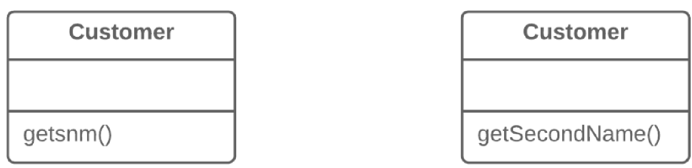

== 1. Спрощення умовних виразів

Ці рефакторинги роблять виклики методів простіше і ясніше для розуміння. Це, в свою чергу, спрощує інтерфейси взаємодії між класами.

=== 1.1. Перейменування методу (Rename Method)

*Проблема*

Назва методу не розкриває суть того, що він робить.

*Рішення*

Змініть назву методу.

*Причини рефакторингу*

Метод міг дістати невдалу назву із самого початку. Наприклад, хтось створив метод похапцем, не надав належного значення хорошій назві.

З іншого боку, метод міг бути названий спочатку вдало, але зважаючи на розширення його функціональності, ім’я методу перестало бути актуальним.

*Переваги*

Покращує читабельність коду. Придумайте для нового методу таку назву, яка б відбивала суть того, що він робить. Наприклад, createOrder(), renderCustomerInfo() і так далі.

*Порядок рефакторингу*

. Перевірте, чи не визначений метод в суперкласі або підкласі. Якщо так, треба буде повторити усі кроки і в цих класах.

. Наступний крок важливий, щоб зберегти працездатність програми під час рефакторингу. Отже, створіть новий метод з новими ім’ям. Скопіюйте туди код старого методу. Видаліть весь код в старому методі, а замість нього додайте виклик нового методу.

. Знайдіть усі звернення до старого методу і замініть їх зверненнями до нового.

. Видаліть старий метод. Цей крок неможливо виконати, якщо старий метод є частиною публічного інтерфейсу. В цьому випадку, старий метод треба помітити як застарілий (deprecated).