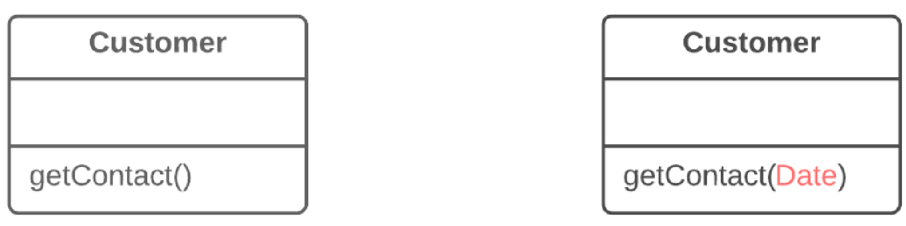

=== 1.2. Додавання параметра (Add Parameter)

*Проблема*

Методу не вистачає даних для здійснення якихось дій.

*Рішення*

Створіть новий параметр, щоби передати ці дані.

*Причини рефакторингу*

Вам необхідно внести якісь зміни в метод. Ці зміни вимагають додаткової інформації або даних, які раніше в метод не подавалися.

*Переваги*

Введення нового параметру завжди змагається з введенням нового приватного поля, яке б містило необхідні методу дані. Виходячи з цього, параметр краще додати тоді, коли вам знадобляться якісь епізодичні дані або такі дані, що часто змінюються, і які немає сенсу тримати в об’єкті весь час. Так рефакторинг буде виправданим. В інших випадках краще ввести приватне поле і заповнювати його потрібними даними перед викликом методу.

*Недоліки*

* Додати новий параметр завжди легше, ніж його прибрати, тому списки параметрів часто розростаються до непристойних розмірів. Це приводить до появи запаху довгий список параметрів.

* Те, що вам знадобився новий параметр, іноді означає, що ваш клас не містить необхідних даних або існуючі параметри не несуть необхідних пов’язаних даних. В обох випадках кращим варіантом було б подумати про переміщення даних в основний клас або в інші класи, об’єкти яких вже доступні усередині методу.

*Порядок рефакторингу*

. Перевірте, чи не є метод вже визначеним в суперкласі або підкласі. Якщо метод в них вже присутній, треба буде повторити усі кроки також в цих класах.

. Наступний крок важливий для того, щоб зберегти працездатність програми під час рефакторингу. Отже, створіть новий метод, скопіювавши старий, і додайте в нього необхідний параметр. Замініть код старого методу викликом нового методу. Ви можете підставити будь-яке значення в новий параметр (наприклад null для об’єктів або нуль для чисел).

. Знайдіть усі звернення до старого методу і замініть їх зверненнями до нового методу.

. Видаліть старий метод. Цей крок стає неможливим, якщо старий метод є частиною публічного інтерфейсу. В цьому випадку старий метод треба помітити як застарілий (deprecated).