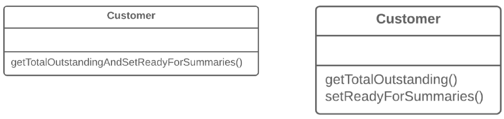

=== 1.4. Розділення запиту і модифікатор (Separate Query from Modifier)

*Проблема*

У вас є метод, який повертає якесь значення, але при цьому в процесі роботи він змінює щось всередині об’єкта.

*Рішення*

Розділіть метод на два різних методи. Один з них нехай повертає значення, а другий модифікує об’єкт.

*Причини рефакторингу*

Цей рефакторинг є реалізацією принципу розділення команд від запитів даних. Суть принципу зводиться до того, щоб відділяти код отримання якихось даних від коду, який змінює щось всередині об’єкта.

Код отримання даних називають запитами, а код зміни видимого стану об’єкта — модифікаторами. Коли запит і модифікатор поєднані, у вас немає способу отримати дані з об’єкта без того, щоб не внести зміни в його стан. Іншими словами, ви ставите питання і можете змінити відповідь прямо в процесі його отримання. Посилюється ця проблема тим, що людина, що викликає запит, може не знати про «побічні дії» такого методу, що нерідко призводить до помилок виконання програми.

Проте варто підкреслити, що «побічними діями» небезпечні тільки ті модифікатори, які міняють видимий стан об’єкта. Це, наприклад, поля, які доступні з публічного інтерфейсу об’єкта, запису в базі даних, у файлах і так далі. Якщо якийсь модифікатор усього лише кешує якусь складну операцію і зберігає її усередині приватного поля класу, він навряд чи приведе до «побічних дій».

*Переваги*

Якщо у вас є запит, який не міняє стан програми, ви можете викликати його скільки завгодно раз, не побоюючись того, що результат змінитися від самого факту виклику методу.

*Недоліки*

В деяких випадках зручно повертати якісь дані після здійснення команди. Наприклад, видаляючи щось з бази даних, ви хочете дізнатися, скільки при цьому рядків було видалено.

*Порядок рефакторингу*

. Створіть новий метод-запит, який би повертав те, що повертав оригінальний метод.

. Зробіть так, щоб оригінальний метод повертав тільки результат виклику нового методу-запиту.

. Замініть всі звернення до оригінального методу викликом методу-запиту. Безпосередньо перед цим рядком потрібно вставити виклик методу-модифікатора. Це вбереже вас від побічних дій в разі, якщо оригінальний метод використовувався в описі умовних операторів і циклів.

. Позбавтеся від коду повернення значення в оригінальному методі. Після цього він стане правильним методом-модифікатором.