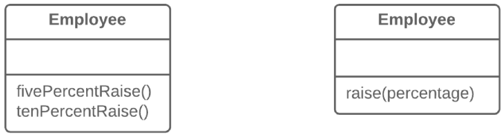

=== 1.5. Параметризація методу (Parameterize Method)

*Проблема*

Декілька методів виконують схожі дії, які відрізняються тільки якимись внутрішніми значеннями, числами або операціями.

*Рішення*

Об’єднайте усі ці методи в один з параметром, в який передаватиметься значення, що відрізняється.

*Причини рефакторингу*

Якщо у вас є схожі методи, скоріш за все, в них знайдеться дублюючий код з усіма витікаючими недоліками.

Крім того, якщо вам треба буде додати ще одну варіацію функціональності, вам доведеться створювати ще один метод. Замість цього можна б було запустити існуючий метод з іншим параметром.

*Недоліки*

* Іноді при проведенні рефакторингу можна перестаратися, в результаті чого у вас з’явиться довгий і складний загальний метод замість декількох простих специфічних.

* Крім того, будьте обережні, виділяючи в параметр перемикач якоїсь функціональності. Надалі це може привести до створення великого умовного оператора, який потрібно буде лікувати за допомогою заміни параметра набором спеціалізованих методів.

*Порядок рефакторингу*

. Створіть новий метод з параметром і помістіть в нього спільний для усіх методів код, застосовуючи відокремлення методу.

. Значення, що відрізняється, замініть на параметр в коді нового методу.

. Для кожного старого методу знайдіть місця, де він викликається, і поміняйте його виклики на виклики нового методу з параметром. Після чого старий метод можна видалити.