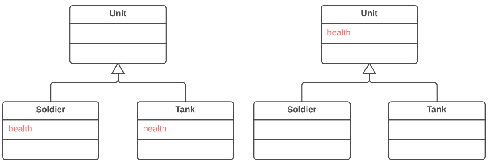

== 1. Задачі узагальнення об'єктів

Узагальнення породжує власну групу рефакторингів, в основному пов’язаних з переміщенням функціональності по ієрархії успадкування класів, створення нових класів та інтерфейсів, а також заміни успадкування делегуванням і навпаки.

=== 1.1. Підйом поля (Pull Up Field)

*Проблема*

Два класи мають одне і те ж поле.

*Рішення*

Перемістіть поле в суперклас, прибравши його з підкласів.

*Причини рефакторингу*

Підкласи розвивалися незалежно один від одного. Це привело до створення однакових (чи дуже схожих) полів і методів.

*Переваги*

. Вбиває дублювання полів в підкласах.

. Полегшує подальше перенесення дублюючих методів з підкласів в суперклас, якщо вони є.

*Порядок рефакторингу*

. Перевірте, чи обидва поля використовуються для однакових потреб в підкласах.

. Якщо поля мають різні назви, дайте їм спільне ім’я і замініть усі звернення до полів в існуючому коді.

. Створіть поле з таким же ім’ям в суперкласі. Зверніть увагу на те, що якщо поля були приватні (private), поле в суперкласі має бути захищеним (protected).

. Видаліть поля з підкласів.

. Можливо, має сенс використати самоінкапсуляцію поля для нового поля, щоби приховати його за методами доступу.
