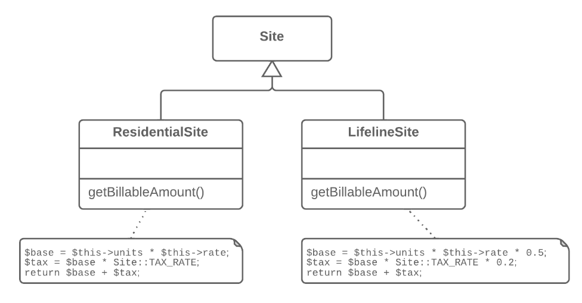
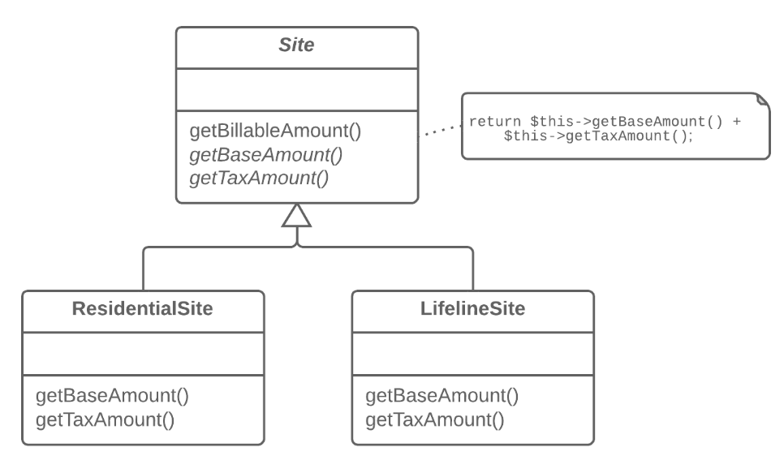

=== 1.10. Створення шаблонного методу (Remove Setting Method)

*Проблема*

В підкласах реалізовані алгоритми, що містять схожі кроки і однаковий порядок виконання цих кроків.

*Рішення*

Винесіть структуру алгоритму і однакові кроки в суперклас, а в підкласах залиште реалізацію кроків, що відрізняються.

*Причини рефакторингу*

Підкласи розвиваються паралельно. Íноді з ними працюють різні люди, що призводить до дублювання коду і помилок, а також до ускладнення підтримки, оскільки кожну зміну доводиться проводити в усіх підкласах.

*Переваги*

Коли ми говоримо про дублювання коду, не завжди мається на увазі програмування методом копіювання-вставки. Часто дублювання виникає на абстрактнішому рівні. Наприклад, у вас є метод сортування чисел і метод сортування колекції об’єктів, при цьому, єдине, чим вони відрізняються це порівняння елементів. Створення шаблонного методу дозволяє впоратися з таким дублюванням, об’єднавши спільні кроки алгоритму в суперкласі і залишивши відмінності для підкласів.

Створення шаблонного методу реалізує принцип відкритості/закритості. Під час реалізації нової версії алгоритму вам треба буде усього лише створити новий підклас, не міняючи існуючий код.

*Порядок рефакторингу*

. Розбийте алгоритми в підкласах на складові частини, описані в окремих методах. У цьому може допомогти витягання методу.

. Методи, що вийшли однаковимі для усіх підкласів, можете сміливо переміщати в суперклас, використовуючи підйом методу.

. Методи, що відрізняються, приведіть до єдиних назв за допомогою перейменування методу.

. Помістіть сигнатури методів, що відрізняються, в суперклас як абстрактні за допомогою підйому методу. Їх реалізації залиште в підкласах.

. І, нарешті, підніміть основний метод алгоритму в суперклас. Він тепер повинен працювати з методами-кроками, описаними в суперкласі — реальними або абстрактними.