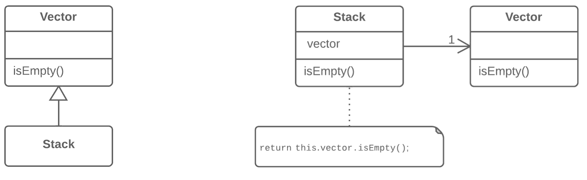

=== 1.11. Заміна наслідування делегуванням (Replace Inheritance with Delegation)

*Проблема*

У вас є підклас, який використовує тільки частину методів суперкласу або не хоче наслідувати його дані.

*Рішення*

Створіть поле і помістіть в нього об’єкт суперкласу, делегуйте виконання методів об’єкта суперкласу, приберіть наслідування.

*Причини рефакторингу*

Заміна наслідування композицією може значно поліпшити дизайн класів, якщо:

* Ваш підклас порушує принцип заміщення Барбари Лісков. Іншими словами, наслідування виникло тільки заради об’єднання спільного коду, але не тому, що підклас є (is-a) розширенням суперкласу.

* Підклас використовує тільки частину методів суперкласу. В цьому випадку, це тільки питання часу, поки хтось не викличе метод суперкласу, який він не повинен був викликати.

Суть рефакторингу зводиться до того, щоб розділити обидва класи, і зробити суперклас помічником підкласу, а не його батьком. Замість того щоб наслідувати усі методи суперкласу, підклас матиме тільки необхідні методи, які делегуватимуть виконання методам об’єкта суперкласу.

*Переваги*

* Клас не містить зайвих методів, які дісталися йому в спадок від суперкласу.

* У поле-делегат можна підставляти різні об’єкти, що мають різні реалізації функціональності. По суті, ви отримуєте реалізацію патерна проектування Стратегія.

*Недоліки*

Доводиться писати дуже багато простих делегуючих методів.

*Порядок рефакторингу*

. Створіть поле в підкласі для утримання суперкласу. На першому етапі додайте в нього поточний об’єкт.

. Змініть методи підкласу так, щоб вони використовували об’єкт суперкласу, замість this.

. Для методів, які були успадковані з суперкласу і які викликаються в клієнтському коді, в підкласі треба створити прості делегуючі методи.

. Приберіть оголошення наслідування з підкласу.

. Змініть код ініціалізації поля-делегата новим об' єктом суперкласу..