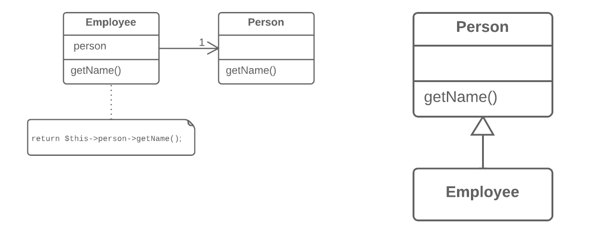

=== 1.12. Заміна делегування наслідуванням (Replace Delegation with Inheritance)

*Проблема*

Клас містить безліч простих делегуючих методів до усіх методів іншого класу.

*Рішення*

Зробіть клас спадкоємцем делегата, після чого делегуючі методи втратять сенс.

*Причини рефакторингу*

Делегування є гнучкішим підходом, ніж наслідування, оскільки дозволяє змінювати поведінку класу на льоту, заміняючи об’єкт, до якого делегується виконання. Проте, застосування делегування перестає бути вигідним, якщо ви делегуєте дії тільки одному класу, причому усім його публічним методам.

Якщо в цьому випадку замінити делегування наслідуванням, ви позбавите клас від безлічі делегуючих методів, а себе від необхідності створювати їх для кожного нового методу класу-делегата.

*Переваги*

Зменшує кількість коду. Вам більше не потрібні усі ці делегуючі методи.

*Коли не слід застосовувати*

* Не застосовуйте рефакторинг, якщо клас містить делегування тільки до частини публічних методів класу-делегата. Цим ви порушите принцип заміщення Барбари Лісков.

* Цей рефакторинг може бути застосований тільки якщо клас ще не має батьків.

*Порядок рефакторингу*

. Зробіть клас підкласом класу-делегата.

. У поле, що містить посилання на об’єкт-делегат, поставте поточний об’єкт.

. Один за іншим видаляйте методи з простим делегуванням. Якщо в них відрізнялися назви, використайте перейменування методу щоби привести усі методи до однієї назви.

. Замініть усі звернення до поля-делегата зверненнями до поточного об’єкта.

. Видаліть поле-делегат.