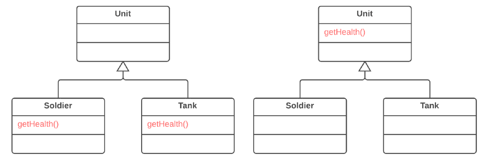

=== 1.2. Підйом методу (Pull Up Method)

*Проблема*

Підкласи мають методи, які роблять схожу роботу.

*Рішення*

В цьому випадку треба зробити методи ідентичними, а потім перемістити їх в суперклас.

*Причини рефакторингу*

Підкласи розвивалися незалежно один від одного. Це привело до створення однакових (чи дуже схожих) полів і методів.

*Переваги*

* Прибирає дублювання коду. Якщо вам треба внести зміни в метод, краще зробити це в одному місці, ніж шукати усі дублікати цього методу в підкласах.

* Також цей рефакторинг можна використати, якщо підклас навіщось перевизначає метод суперкласу, але, по суті, робить ту ж роботу.

*Порядок рефакторингу*

. Обстежте схожі методи в суперкласах. Якщо вони не однакові, приведіть їх до одного і того ж виду.

. Якщо методи використовують різний набір параметрів, приведіть ці параметри до того виду, який ви хочете бачити в суперкласі.

. Скопіюйте метод в суперклас. Тут ви можете зіткнутися з тим, що код методу використовує поля і методи, які є тільки в підкласах, а тому недоступні в суперкласі. Щоб розв’язати цю проблему, вам треба:

    ** Для полів: або підніміть потрібні поля в суперклас, або використайте самоінкапсуляцію поля для створення геттерів і сеттерів в підкласах, а потім оголосіть ці геттери абстрактним методом в суперкласі.

    ** Для методів: або підніміть потрібні методи в суперклас, або оголосіть для них абстрактні методи в суперкласі (зверніть увагу, ваш клас стане абстрактним, якщо не був таким до цього часу).

. Видаліть методи в підкласах.

. Перевірте місця, в яких викликається метод. Можливо, в деяких з них використання підкласу можна замінити суперкласом.