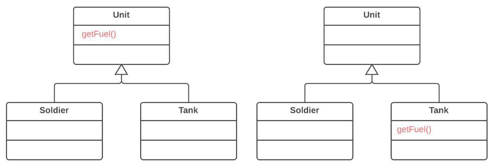

=== 1.4. Спуск методу (Push Down Method)

*Проблема*

Поведінка, реалізована в суперкласі, використовується тільки одним або декількома підкласами.

*Рішення*

Перемістіть цю поведінку в підкласи.

*Причини рефакторингу*

Метод, який планували зробити універсальним для усіх класів, по факту використовується тільки в одному підкласі. Така ситуація може виникнути, коли плановані фічи так і не були реалізовані.

Крім того, така ситуація може виникнути після відокремлення (чи видалення) частини функціональності з ієрархії класів, після якого метод залишився використовуваним тільки в одному підкласі.

Якщо ви бачите, що метод потрібний більш ніж одному підкласу (але не всім), можливо, варто створити проміжний підклас і перемістити метод в нього. Це дозволить уникнути дублювання коду, яке виникло б при спуску методу в усі підкласи.

*Переваги*

Покращує зв’язність усередині класів. Метод знаходиться там, де ви очікуєте його побачити.

*Порядок рефакторингу*

. Оголосіть метод в підкласі і скопіюйте його код з суперкласу.

. Видаліть метод з суперкласу.

. Знайдіть усі місця, де використовується метод, і переконаєтеся, що він викликається з потрібного підкласу.