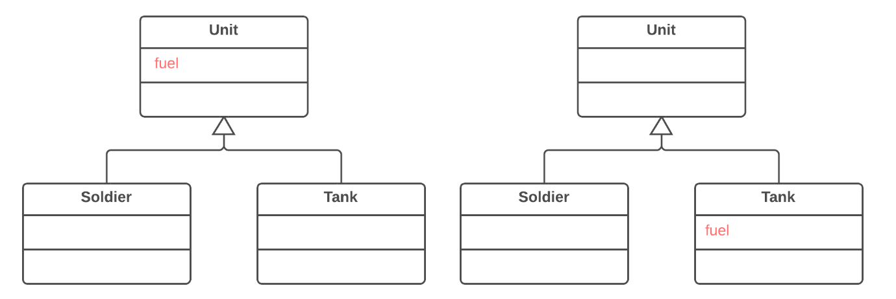

=== 1.5. Спуск поля (Push Down Field)

*Проблема*

Поле використовується тільки в деяких підкласах.

*Рішення*

Перемістіть поле в ці підкласи.

*Причини рефакторингу*

Поле, яке планували зробити універсальним для усіх класів, по факту, використовується тільки в деяких підкласах. Така ситуація може виникнути, коли плановані фічи так і не були реалізовані.

Крім того, така ситуація може виникнути після відокремлення (чи видалення) частини функціональності з ієрархії класів.

*Переваги*

* Покращує зв’язність усередині класів. Поле знаходиться там, де воно реально використовується.

* При переміщенні в декілька підкласів одночасно, з’являється можливість розвивати поля незалежно одне від одного. Правда, така дія створює дублювання коду, тому варто спускати поля, тільки якщо ви дійсно маєте намір використовувати їх по-різному.

*Порядок рефакторингу*

. Оголосіть поле в усіх необхідних підкласах.

. Видаліть поле з суперкласу.

