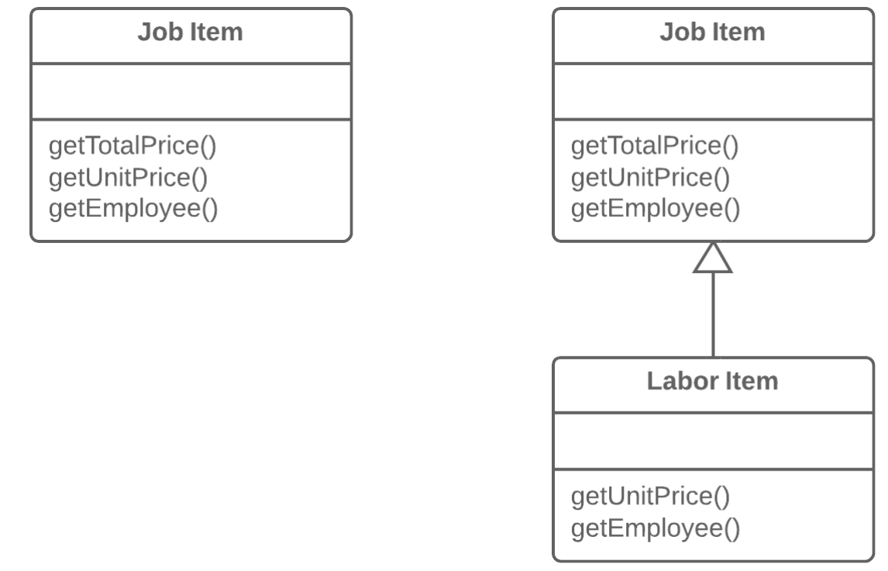

=== 1.6. Витягання підкласу (Extract Subclass)

*Проблема*

Клас має фічи, які використовуються тільки в певних випадках.

*Рішення*

Створіть підклас і використовуйте його в цих випадках.

*Причини рефакторингу*

В основному класі знаходяться методи і поля для реалізації якогось окремого випадку використання класу. Цей випадок, хоч і дуже рідкісний, є частиною обов’язків класу, тому усі пов’язані з ним поля і методи неправильно було б винести в абсолютно інший клас. Але, з іншого боку, їх можна винести в підклас за допомогою цього рефакторингу.

*Переваги*

* Створити підклас досить легко і швидко.

* Можна виділити декілька різних підкласів, якщо основний клас реалізує декілька подібних особливих випадків.

*Недоліки*

* Незважаючи на усю очевидну простоту, Наслідування може завести вас у безвихідь, якщо доведеться виділити декілька різних ієрархій класів. Наприклад, якщо у вас був клас Собаки, поведінка якого відрізняється залежно від розміру і довжини шерсті собак. Ви виділили з нього дві ієрархії:
    ** за розміром: Великі, Середні і Маленькі
    ** по довжині шерсті: Гладкошерсті і Довгошерсті
* І все б добре, але у вас почнуться проблеми, коли треба буде створити одночасно Великого і Гладкошерстого собаку, оскільки об’єкт можна створити лише з одного класу. З іншого боку, цю проблему можна обійти, використовуючи Композицію замість Наслідування(див. патерн Стратегія). Іншими словами, клас Собака матиме два поля-компонента — розмір і довжину шерсті. У ці поля ви підставлятимете об’єкти-компоненти необхідних класів. Наприклад, ви зможете створити Собаку, що має ВеликийРозмір і ДовгуШерсть.

*Порядок рефакторингу*

. Створіть новий підклас з класу, що вас цікавить.

. Якщо для створення об’єктів підкласу будуть потрібні якісь додаткові дані, створіть конструктор і доповніть його потрібними параметрами. Не забудьте викликати батьківську реалізацію конструктора.

. Знайдіть усі виклики конструктора батьківського класу. У тих випадках, коли потрібна також функціональність підкласу, замініть батьківський конструктор конструктором підкласу.

. Перемістіть потрібні методи і поля з батьківського класу в підклас. Використайте для цього спуск методу і спуск поля. Найпростіше розпочинати перенесення з методів. Тоді поля будуть доступні для них весь час: з батьківського класу до перенесення, і з самого підкласу після закінчення перенесення.

. Після того, як підклас готовий, знайдіть усі старі поля, які управляли тим, який набір функцій повинен виконуватися. Ці поля можна видалити, замінивши поліморфізмом усі умовні оператори, в яких вони використовувалися. Простий приклад — у вас в класі Автомобіль було поле isElectricCar, і залежно від нього, в методі refuel() в машину або заливається бензин, або заряджається електрика. В результаті рефакторингу, поле isElectricCar буде видалено, а класи Автомобіль і Електроавтомобіль матимуть свої реалізації методу refuel().