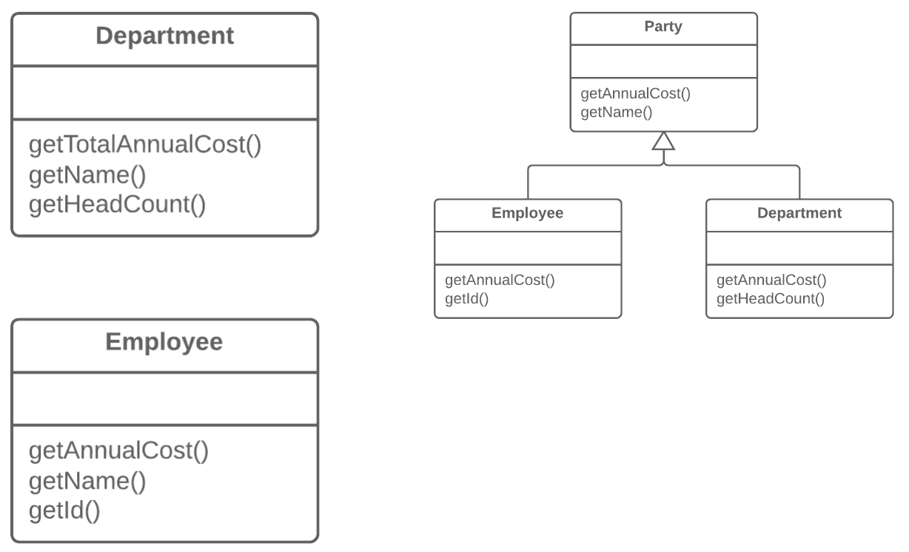

=== 1.7. Відокремлення суперкласу (Extract Superclass)

*Проблема*

У вас є два класи із схожими полями і методами.

*Рішення*

Створіть для них спільний суперклас і перенесіть туди схожі поля і методи.

*Причини рефакторингу*

Одним з видів дублювання коду є наявність двох класів, що виконують схожі завдання однаковим способом або схожі завдання різними способами. Об’єкти надають вбудований механізм для спрощення такої ситуації за допомогою наслідування. Проте часто спільність виявляється непоміченою до тих пір, поки не будуть створені якісь класи, і тоді з’являється необхідність створювати структуру наслідування пізніше.

*Переваги*

Прибирає дублювання коду. Схожі поля і методи тепер «живуть» тільки в одному місці.

*Коли не слід застосовувати*

Ви не можете застосувати цей рефакторинг до класів, які вже мають суперклас.

*Порядок рефакторингу*

. Створіть абстрактний суперклас.

. Використайте підйом поля, підйом методу і підйом тіла конструктора для переміщення спільної функціональності в суперклас. Краще розпочинати з полів, оскільки окрім спільних полів, вам треба буде перенести ті з них, які використовуються в спільних методах.

. Варто пошукати місця в клієнтському коді, в яких можна замінити використання підкласів вашим спільним класом (наприклад, в оголошеннях типів).