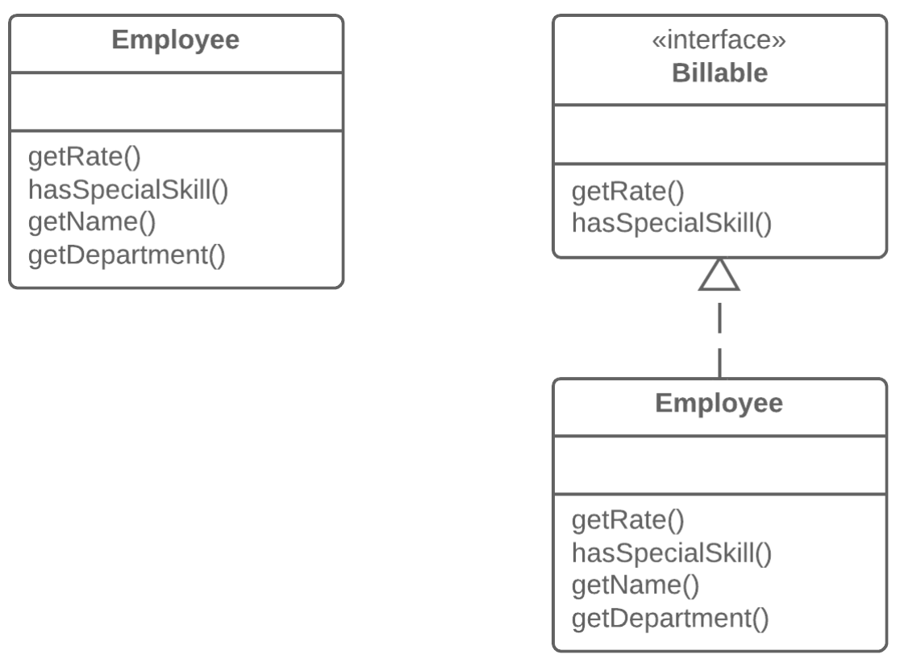

=== 1.8. Відокремлення інтерфейсу (Extract Interface)

*Проблема*

Декілька клієнтів користуються однією і тією ж частиною інтерфейсу класу. Або в двох класах частина інтерфейсу виявилася спільною.

*Рішення*

Виділіть цю спільну частину в свій власний інтерфейс.

*Причини рефакторингу*

. Інтерфейси бувають корисні, коли один клас може відігрувати різноманітні ролі в залежності від ситуації. Використайте відокремлення інтерфейсу щоб явно позначити кожну з ролей.

. Ще одна слушна нагода виникає, коли потрібно описати операції, які клас виконує на своєму сервері. Якщо в майбутньому передбачається дозволити використання серверів декількох видів, усі вони повинні реалізовувати цей інтерфейс.

*Корисні факти*

Є деяка схожість між відокремленням суперкласу і відокремленням інтерфейсу.

Відокремлення інтерфейсу дозволяє виділяти тільки спільні інтерфейси, але не спільний код. Іншими словами, якщо в класах знаходиться дублюючий код, то, застосувавши відокремлення інтерфейсу, ви ніяк не позбавитеся від цього дублювання.

Проте, цю проблему можна зменшити, застосувавши відокремлення класу для розміщення поведінки, що містить дублювання, в окремий компонент і делегування йому усієї роботи. У випадку, якщо об’єм спільної поведінки виявиться досить великим, завжди можна застосувати відокремлення суперкласу. Звичайно, це навіть простіше, але пам’ятайте, що при цьому ви отримуєте тільки один батьківський клас.

*Порядок рефакторингу*

. Створіть порожній інтерфейс.

. Оголосіть спільні операції в інтерфейсі.

. Оголосіть потрібні класи, які будуть реалізовуюти цей інтерфейс.

. Змініть оголошення типів в клієнтському коді так, щоб вони використовували новий інтерфейс.