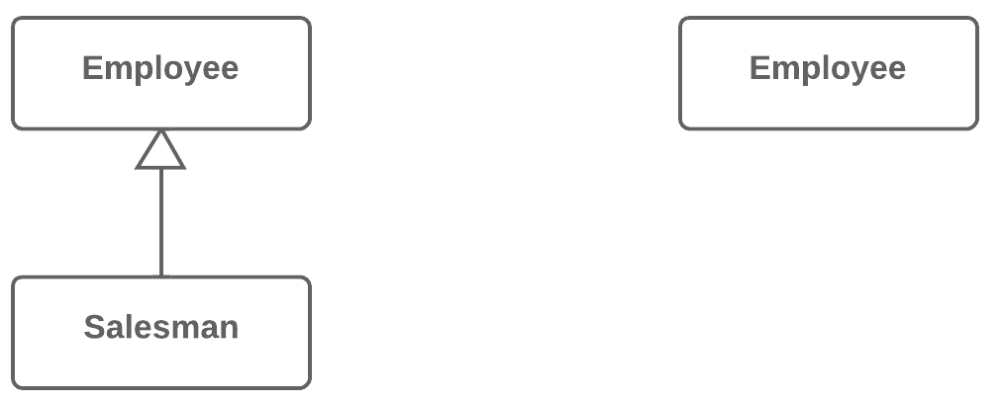

=== 1.9. Згортання ієрархії (Collapse Hierarchy)

*Проблема*

У вас є деяка ієрархія класів, в якій підклас мало чим відрізняється від суперкласу.

*Рішення*

Злийте підклас і суперклас воєдино.

*Причини рефакторингу*

Розвиток програми привів до того, що підклас і суперклас стали дуже мало відрізнятися один від одного. Якась фіча була прибрана з підкласу, якийсь метод «переїхав» в суперклас, і ось ви вже маєте два практично однакових класи.

*Переваги*

* Зменшується складність програми. Менше класів, менше різних речей, які треба тримати в голові, менше «рухомих частин», менше ймовірність зламати щось при подальших змінах в коді.

* Навігація за кодом стає простіша, коли методи визначені тільки в одному класі. Потрібний метод не доводиться шукати за усією ієрархією.

*Коли не слід застосовувати*

* Якщо в ієрархії класів знаходиться більше одного підкласу, то після проведення рефакторингу, решта підкласів повинні стати спадкоємцями класу, в якому була об’єднана ієрархія.

* Проте майте на увазі, що це може привести до порушення принципу підстановки Барбари Лісков. Наприклад, якщо в програмі емуляторі міського транспорту невірно згорнути суперклас Транспорт в підклас Автомобіль, клас Літак може виявитися спадкоємцем Автомобіля, а це вже неправильно.

*Порядок рефакторингу*

. Виберіть, який клас прибрати зручніше: суперклас або підклас.

. Використайте підйом поля і підйом методу, якщо ви вирішили позбутися від підкласу. Використайте спуск поля і спуск методу, якщо прибраний буде суперклас.

. Замініть усі використання класу, який буде видалений, класом, в який переїжджають поля і методи. Найчастіше це буде код створення класів, вказівки типів параметрів і змінних, а також документації в коментарях.

. Видаліть порожній клас.