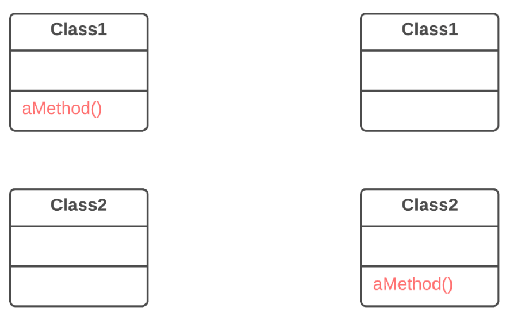

== 1. Переміщення функцій між об'єктами

Якщо ви розмістили функціональність по класах не найвдалішим чином - це ще не привід впадати у відчай.

Рефакторинги цієї групи показують як безпечно переміщати функціональність з одних класів в інші, створювати нові класи, а також приховувати деталі реалізації з публічного доступу.

=== 1.1. Переміщення методу (Move Method)

*Проблема*

Метод використовується в іншому класі більше, ніж у власному.

*Рішення*

Створіть новий метод в класі, який використовує його більше інших, і перенесіть туди код із старого методу. Код оригінального методу перетворіть на звернення до нового методу в іншому класі або приберіть його взагалі.

*Причини рефакторингу*

Чим більше коду в методі, тим складніше розібратися в тому, що він робить. Це основна проблема, яку вирішує даний рефакторинг.

Відокремлення методу не лише вбиває безліч запахів в коді, але й є одним з етапів безлічі інших рефакторингів.

*Переваги*

. Ви вирішили перемістити метод в клас, де знаходяться дані, з якими, в основному, і працює цей метод. Цим ви збільшуєте зв’язність усередині класів.
. Ви хочете перемістити метод, щоби прибрати або зменшити залежність класу, що викликає цей метод, від класу, в якому він знаходився. Це може бути корисно у випадку, коли клас, що викликає, вже має залежність від того класу, куди ви плануєте перенести метод. Таким чином, ви зменшуєте зв’язаність між класами.

*Порядок рефакторингу*

. Перевірте всі фічі, які були використані старим методом в його ж класі. Можливо, їх теж слід перемістити. Керуйтеся таким правилом — якщо фіча використовується методом, що вас зараз цікавить, її точно слід переносити. Якщо фіча використовується також іншими методами, можливо, слід перенести і ці методи. Іноді набагато простіше перенести пачку методів, ніж налаштовувати взаємодію між ними в різних класах.
. Перевірте, чи не оголошений потрібний вам метод в суперкласах і підкласах одержувача. Якщо це так, вам доведеться або відмовитися від ідеї перенесення, або реалізувати в класі-одержувачі подібність поліморфізму, щоб забезпечити різну функціональність методу, яка була рознесена по класах-донорах.
. Оголосіть новий метод в класі-одержувачі. Можливо, слід придумати для методу нове ім’я, яке в новому класі підходитиме йому більше.
. Визначте, яким чином ви звертатиметеся до класу-одержувачу. Цілком можливо, у вас вже є поле або метод, які повертають відповідний об’єкт, але якщо ні, треба буде написати новий метод або поле, в якому б зберігався об’єкт класу-одержувача.
. Тепер у вас є спосіб звертатися до об’єкта-одержувача і новий метод в його класі. А тому ви вже можете перетворити старий метод на звернення до нового методу.
. Оцініть, чи є можливість видалити старий метод взагалі? При цьому потрібно буде у всіх місцях, де використовується цей метод, поставити звернення до нового.