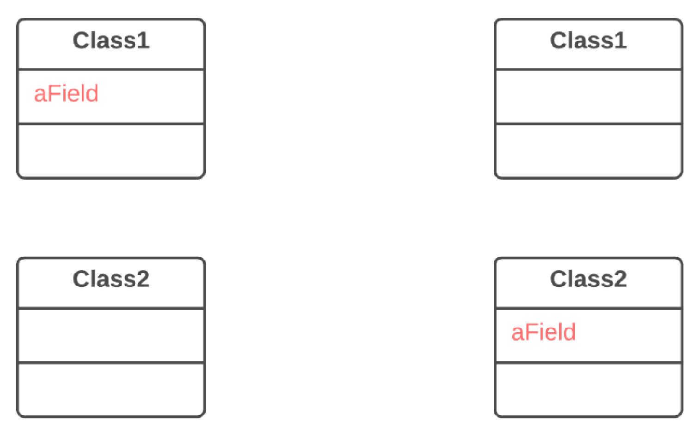

=== 1.2. Переміщення поля (Move Field)

*Проблема*

Поле використовується в іншому класі більше, ніж у власному.

*Рішення*

Створіть поле в новому класі і перенаправляйте до нього всіх користувачів старого поля.

*Причини рефакторингу*

Часто поля переносяться як частини відокремлення одного класу з іншого. Вирішити, в якому з класів повинне залишитися поле, буває непросто. Проте, у нас є непоганий рецепт — поле має бути там, де знаходяться методи, які його використовують (або там, де цих методів більше).

Це правило допоможе вам і в інших випадках, коли поле просто знаходиться не там, де треба

*Порядок рефакторингу*

. Якщо поле публічне, вам буде набагато простіше виконати рефакторинг, якщо ви зробите його приватним і надасте публічні методи доступу (для цього можна використати рефакторинг інкапсуляція поля).

. Створіть таке ж поле з методами доступу в класі-одержувачі.

. Визначте, як ви звертатиметеся до класу-одержувача. Цілком можливо, у вас вже є поле або метод, які повертають відповідний об’єкт. Якщо ні — треба буде написати новий метод або поле, в якому б зберігався об’єкт класу-одержувача.

. Замініть усі звернення до старого поля на відповідні виклики методів в класі-одержувачі. Якщо поле не приватне, виконайте це і в суперкласі, і в підкласах.

. Видаліть поле в класі-донорі.