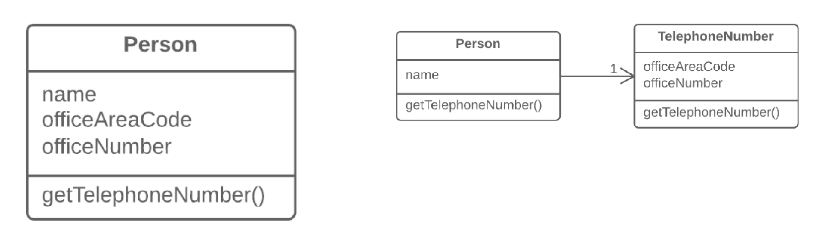

=== 1.3. Відокремлення класу (Extract Class)

*Проблема*

Один клас працює за двох.

*Рішення*

Створіть новий клас, перемістіть в нього поля і методи, що відповідають за певну функціональність.

*Причини рефакторингу*

Класи завжди спочатку виглядають чіткими і зрозумілими. Вони виконують свою роботу і не лізуть в обов’язки інших класів. Проте, з ходом життя програми додається один метод — тут, одне поле — там. В результаті деякі класи отримують масу додаткових обов’язкі

*Переваги*

* Цей рефакторинг покликаний допомогти в дотриманні принципу єдиного обов’язку класу. Це робить код ваших класів очевидніше і зрозуміліше.
* Класи з єдиним обов’язком надійніші і стійкіші до змін. Наприклад, у вас є клас, що відповідає за десять різних речей. І коли вам доведеться вносити в нього зміни, ви ризикуєте при коригуваннях однієї речі зламати інші.

*Недоліки*

Якщо при проведенні цього рефакторингу ви занадто захопитеся, доведеться вдатися до вбудовування класу.

*Порядок рефакторингу*

Перед початком рефакторингу обов’язково визначите, як саме слід розділити обов’язки класу.

. Створіть новий клас, який міститиме виділену функціональність.

. Створіть зв’язок між старим і новим класом. Краще за все, якщо цей зв’язок буде одностороннім; при цьому другий клас можна буде без проблем використати повторно. З іншого боку, якщо ви вважаєте, що це необхідно, завжди можна створити двосторонній зв’язок.

. Використайте переміщення поля і переміщення методу для кожного поля і методу, які ви вирішили перенести в новий клас. Для методів має сенс розпочинати з приватних, таким чином ви знижуєте ймовірність допустити масу помилок. Намагайтеся рухатися помалу і тестувати результат після кожного переміщення, це позбавить вас від необхідності виправляти багато помилок в самому кінці роботи. Коли з переміщенням було покінчено, подивіться ще раз на класи, що вийшли. Можливо, старий клас тепер має сенс назвати по-іншому, зважаючи на його нові обов’язки. Перевірте ще раз, чи можна позбутися від двостороннього зв’язку між класами, якщо він з’явився.

. Ще одним нюансом є доступність нового класу ззовні. Ви можете повністю сховати його від клієнта, зробивши приватним, і в той же час управляти його полями із старого класу. Або зробити його публічним, надавши клієнтові можливість безпосередньо міняти значення. Рішення залежить від того, наскільки безпечні для поведінки старого класу будуть несподівані прямі зміни значень в новому класі.