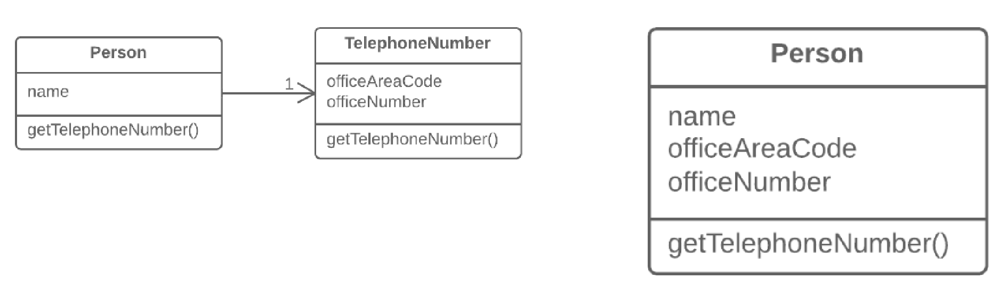

=== 1.4. Вбудовування класу (Inline Class)

*Проблема*

Клас майже нічого не робить, ні за що не відповідає, і ніякої відповідальності для цього класу не планується.

*Рішення*

Перемістіть усі фічі з цього класу в інший.

*Причини рефакторингу*

Часто цей рефакторинг стає наслідком недавнього «перенесення» частини фіч з одного класу в інший, після чого від початкового класу мало що залишилося.

*Переваги*

Менше даремних класів — більше вільної оперативної пам’яті, у тому числі, і у вас в голові.

*Порядок рефакторингу*

. Створіть в класі-одержувачі публічні поля і методи, такі ж, як в класі-донорі. Методи повинні звертатися до аналогічних методів класу-донору.

. Замініть усі звернення до класу-донору зверненнями до полів і методів класу-одержувача.

. Саме час протестувати програму і переконатися, що під час роботи не було допущено ніяких помилок. Якщо тести показали, що все працює так, як потрібно, починаємо виконувати переміщення методу і переміщення поля для того, щоби повністю перемістити весь функціонал в клас-приймач з початкового класу. Продовжуємо робити це, поки початковий клас не виявиться зовсім порожнім.

. Видаліть початковий клас.