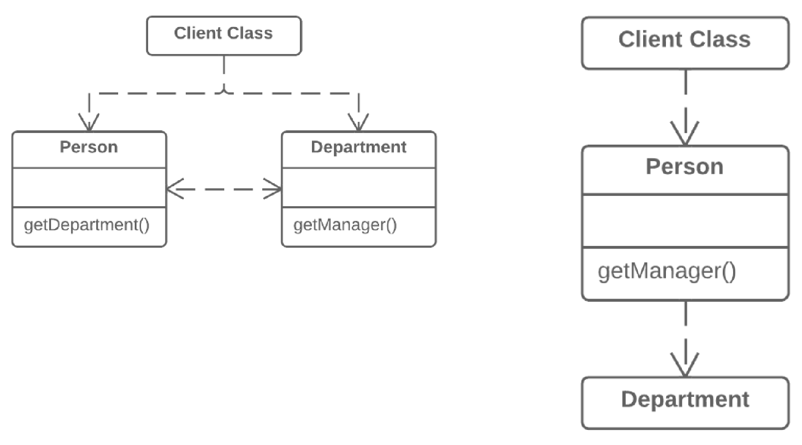

=== 1.5. Приховання делегування (Hide Delegate)

*Проблема*

Клієнт отримує об’єкт B з поля або методу об’єкта А. Потім клієнт викликає якийсь метод об’єкта B.

*Рішення*

Створіть новий метод в класі А, який би делегував виклик об’єкта B. Таким чином, клієнт перестане знати про клас В і залежати від нього.

*Причини рефакторингу*

Спершу слід визначитися з назвами:

* Сервер — це об’єкт, до якого клієнт має безпосередній доступ.

* Делегат — це кінцевий об’єкт, який містить функціональність, потрібну клієнтові.

Ланцюжок викликів з’являється тоді, коли клієнт запитує з одного об’єкта інший, потім вже другий об’єкт запитує ще один і так далі. Такі послідовності викликів означають, що клієнт пов’язаний з навігацією по структурі класів. Будь-які зміни проміжних зв’язків означають необхідність модифікації клієнта.

*Переваги*

Приховує делегування від клієнта. Чим менше клієнтський код знає подробиць про зв’язки між об’єктами, тим простіше згодом вноситиме зміни в програму.

*Недоліки*

Якщо потрібно створити занадто багато делегуючих методів, клас-сервер ризикує перетворитися на зайву проміжну ланку і привести до запаху посередник.д.

*Порядок рефакторингу*

. Для кожного методу класа-делегата, що викликається клієнтом, треба створити метод в класі-сервері, який би делегував виклик класу-делегату.
. Змініть код клієнта так, щоб він викликав методи класу-сервера.
. Якщо після всіх змін клієнт більше не має потреби в класі-делегаті, можна прибрати метод доступу до класу-делегата з класу-сервера (той метод, який використовувався спочатку для отримання класу-делегата).