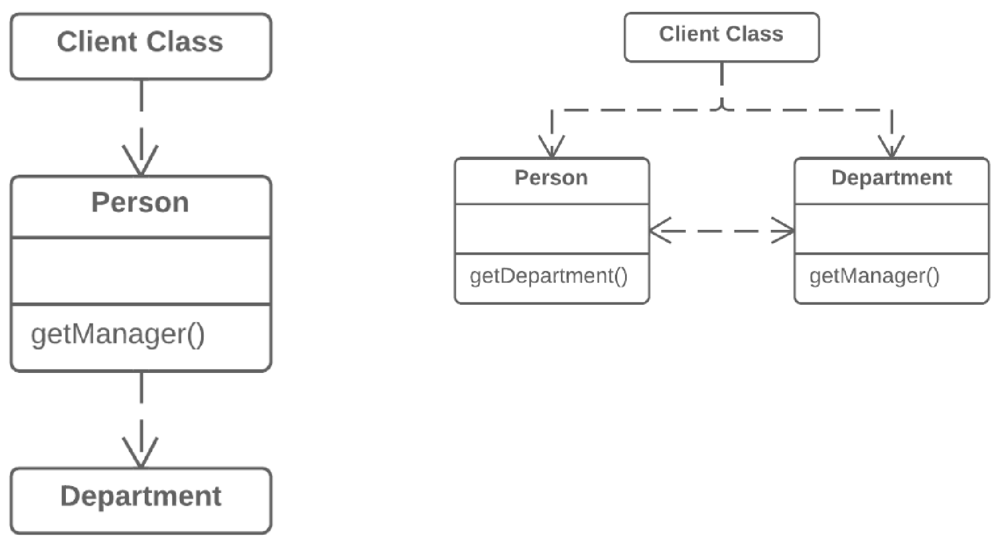

=== 1.6. Видалення посередника (Remove Middle Man)

*Проблема*

Клас має занадто багато методів, які просто делегують роботу іншим об’єктам.

*Рішення*

Видаліть ці методи і змусьте клієнта викликати кінцеві методи безпосередньо.

*Причини рефакторингу*

У цьому рефакторингу ми використаємо назви з приховання делегування, а саме:

* Сервер — це об’єкт, до якого клієнт має безпосередній доступ.
* Делегат — це кінцевий об’єкт, який містить функціональність, потрібну клієнтові.

Існує два різновиди проблем:

. Клас-сервер нічого не робить сам по собі, створюючи зайву складність. В цьому випадку варто замислитися, чи потрібний цей клас взагалі.
. Кожного разу, коли в делегаті з’являється нова фіча, для неї треба створювати делегуючий метод у класі-сервері. Це може бути невигідно при великій кількості змін.

*Порядок рефакторингу*

. Створіть геттер для доступу до об’єкта класу-делегата з об’єкта класу-сервера.
. Замініть виклики делегуючих методів класу-сервера прямими викликами методів класу-делегата.