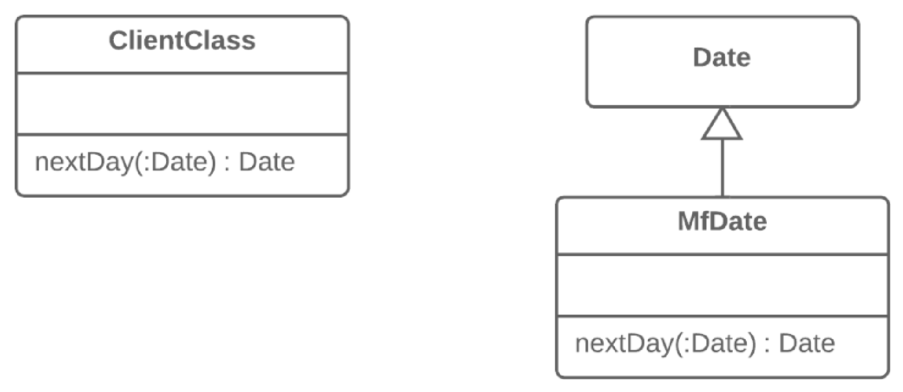

=== 1.8. Введення локального розширення (Introduce Local Extension)

*Проблема*

В службовому класі відсутні деякі методи, які вам потрібні. При цьому додати їх в цей клас ви не можете

*Рішення*

Створіть новий клас, який би містив ці методи, і зробіть його спадкоємцем службового класу, або його обгорткою.

*Причини рефакторингу*

В класі, який ви використовуєте, немає потрібних вам методів. Або ще гірше — ви не можете їх туди додати (наприклад, тому що класи знаходяться в сторонній бібліотеці). У вас є два шляхи:

* Створити підклас з класу, що цікавить, у якому будуть знаходитись нові методи, і який унаслідує все інше з батьківського класу. Цей шлях простіший, але іноді буває заблокований в самому службовому класі за допомогою директиви final.
* Створити клас-обгортку, у якому будуть знаходитись усі нові методи, а решту він буде делегувати пов’язаному об’єкту службового класу. Цей шлях більш складний, оскільки вам треба буде написати не лише код підтримки зв’язку між обгорткою і службовим об’єктом, але і велику кількість простих делегуючих методів, які будуть емулювати публічний інтерфейс службового класу.

*Переваги*

Якщо додаткові методи розміщуються в окремому класі-розширенні (в обгортці або підкласі), ви не засмічуєте клієнтські класи кодом, який їм не належить по сенсу. Цим підвищується зв’язність компонентів програми і можливість їх повторного використання.

*Недоліки*

. Створюється ще один клас, підвищуючи загальну складність програми.

*Порядок рефакторингу*

. Створіть новий клас-розширення:
    * або зробіть його спадкоємцем службового класу;

    * або, якщо ви вирішили робити обгортку, створіть в спеціальне поле для зберігання об’єкта службового класу, до якого відбуватиметься делегування. У цьому випадку треба буде створити ще і методи, які повторюють публічні методи службового класу і містять просте делегування до методів службового об’єкта.
. Створіть конструктор, що використовує параметри конструктору службового класу.
. Також створіть альтернативний «конвертуючий» конструктор, який приймає в параметрах тільки об’єкт оригінального класу. Це допоможе в підстановці розширення замість об’єктів оригінального класу.
. Створіть в класі нові розширені методи. Перемістіть в нього зовнішні методи з інших класів, або видаліть їх, якщо розширення вже має такий функціонал.
. Замініть використання службового класу новим класом-розширенням в тих місцях, де потрібна розширена функціональність.